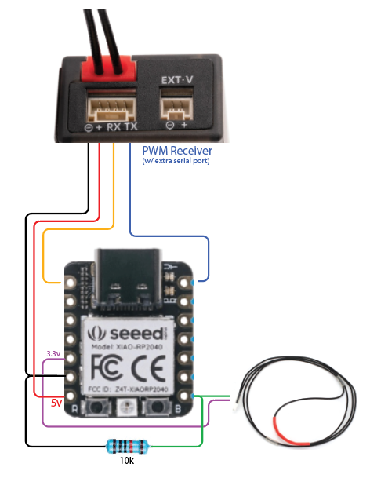

# CRSFSensor_temp_RP2040 .ino

## Serve-everything-to-CRSF Sensor / Hijack CRSF \
( With specific example of temperature )

---

The CRSF protocol is born for drones, and has a limited set of sensor variables when considering
RC at large. For example, there's no temperature variables. So this sensor was created to make use of
the CRSF protocol for purposes other than stock. I would like a temperature sensor on each cylinder of
an engine, so I will use other telemetry variables to send the data to my EdgeTx transmitter,
which can be told to display/read the data in various formats / units.

---

### Microcontroller / Arduino Board
This sketch was written for the `Seeed Studio XIAO RP2040` board, but should work with any microcontroller
compatible with `CRSFforArduino` ( ESP32, RP2040, SAMD21, SAMD5x, SAME5x, STM32, and Teensy 4.x. )

> Arduino IDE setup for XIAO RP2040:
> 
> https://wiki.seeedstudio.com/XIAO-RP2040-with-Arduino/


#### NOTE: Using the Seeed Studio XIAO RP2040
The above setup of the XIAO RP2040 worked perfect for me, when you click the 'upload' button in the Arduino IDE
it all worked perfectly.

However, after installing my sketch with the CRSF library, it stopped automatically finding the RP2040
board; it required putting it into "bootloader" mode, which is easy to do:
  - hold the "boot" button
  - press the "reset" button
  - click to upload your code in Arduino IDE

### Dependencies
- CRSFforArduino - https://github.com/ZZ-Cat/CRSFforArduino

(Kudos to "ZZ Cat" and collaborators, super handy library)

Once Arduino is set up, install the `CRSFforArduino` library:
 - visit the link above, on right hand side there is a "releases" section.
   - click link to latest release
   - on the next page, scroll to the bottom and download the .zip file
 - Open the Arduino IDE
   - go to Sketch -> Include Library -> Add .ZIP Library...
   - select the .zip file you downloaded 


### Shopping List
 - Seeed Studio XIAO RP2040
 - "DSMR/DSMX Telemetry Temperature Sensor" by SpektrumRC\
   ( It is just a thermistor that is already set up for high heat of engine cylinder heads.
   You could use any thermistor, but this code is calibrated for this product. Details below
   to calibrate a different thermistor. )
 - 10kOhm resistor
 - The RP2040 board takes 5v, so from RC gear voltage you may need a regulator/BEC.\
   ( https://www.amazon.com/dp/B07PLSYX9G ...a really small off-the-shelf BEC to 5v, 3A )
   
   
### Wiring
- CRSF serial is connected to "Serial1"
  - Rx: pin 7 (connects to tx on ExpressLRS receiver)
  - Tx: pin 6 (connects to rx on ExpressLRS receiver)

- Thermistor (optional, you can also delete the related code below)
  - connect Thermistor to 3.3v and pin A0
  - connect 10kOhm resistor to A0 and ground
  - use multimeter to get actual value of resistor and update "resistorValue" in the code\
    ( my resistor was 9.3kOhms measured )



### Calibrating a different thermistor?
You can use any thermistor, but to be honest I don't know what the calibration values
are. I got the thermistor code below (the "Steinhart-Hart coefficients", etc) by getting
the Spektrum RC thermistor and a thermometer and raising the temperature of some water
from near freezing to boiling. I then fed that data into ClaudeAI/chatGPT and asking
it to generate the code :)

...I fussed around with it a little, but seems consistent
with the thermometer I used to get the calibration data. Using a different thermistor
I'd just do the same thing, then provide the thermistor code below to AI prompt, along
with new calibration data, and asking it to update to match.


## Hijacking CRSF

The code shows 13 lines of variables that you can apply the data of what you need.

Example:
```cpp
  // Battery --
  crsf->telemetryWriteBattery(
    12345, // voltage       - RxBat - [ "12345" shows in as EdgeTx "123.5" - multiply by 100 ]
    12345, // current       - Curr  - [ "12345" shows in as EdgeTx "123.4" - multiply by 100 ]
    12345, // capacity left - Capa  - [ no change to EdgeTx ]
    123    // capacity pct  - Bat%  - [ no change, but small 8 bit number, "123" is "123%" ]
  );
```

...the "12345" values are just placeholders, replace with data you actually care about. The "RxBat",
"Curr", "Capa", and "Bat%" are the names of the telemetry items in EdgeTx. The comments on the right
explain if there's any math to do to get the data to display correctly in EdgeTx.


There's a comment
on each line as to how they come out in EdgeTx (the name of the telemetry item, how the numbers turn up,
etc). You can change these to whatever you like, and then in EdgeTx you can configure the sensor to
change the units, precision. In EdgeTx you can even create a "calculated" sensor that does math with
other sensors, like "2.65" value to be "265".

Just pick the values you don't need, put in the data you want, and away you go.


### Temperature
In the code there is '`temperatureF`' and '`temperatureC`' variables ready to go.

Just replace whatever number you want in any of the '`write`' calls to supply the data to the
CRSF protocol.
 

Example, let's send Celcius and Farenheit temperatures using the GPS altitude and speed variables respectively:

```cpp
  crsf->telemetryWriteGPS( 0.0, 0.0,   // latitude/longitude - not useful for hijacking purposes
    (temperatureC * 100),              // altitude  - Alt  - [ "12345" reaches EdgeTx as 123, multiply by 100 ]
    calculateGPSSpeed( temperatureF ), // speed     - GSpd
    0,                                 // heading
    0                                  // GPS sats
  );
```
...the comment on the same line as 'temperatureC' above, `"12345" reaches EdgeTx as 123"`, means that
we need to multiply the temperature by 100 to get it to display as we need in EdgeTx. "calculateGPSSpeed()"
function is taking care of what the 'speed' variable needs to read correctly in EdgeTx.


### Strange, but whatever...
There are two 'Alt' values sent in CRSF; one from a Vario sensor, and one from a GPS sensor. Whatever, but
it's a handy value to make use of as it does not seem to go through any shenanigans like roll/pitch/yaw does,
can be a large value.

¯\_(ツ)_/¯


## EdgeTx Configuration

In EdgeTx, go to the "Telemetry" tab for your model, '`discover sensors`' should bring in the telemetry
with your data. Then select the sensor you're interested in, edit, and change the units type, precision,
etc. `'Units'` being the key change, as that will have it read out "123 degrees celcius" rather than
"123 meters" or whatever it was telemetry value you hijacked. 

Many things are possible on the telemetry screen; you can copy the sensor and make changes to the copy to
leave the original alone. You can also create a "calculated" sensor that does math with other sensors (like scale "2.65" value to
be "265"), change the name, etc etc. The calculations can be clunky (as you can only do math with values
of other sensor items) but it does work and is super flexible.

---

---


