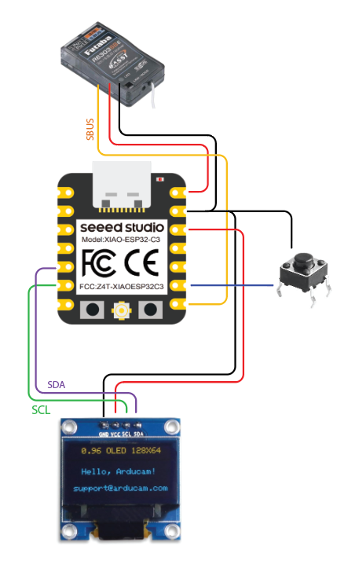

# OledSbusViewer_xiaoESP32c3 .ino

## View-Sbus-Deets-On-OLED
( with fancy-pants button to change channel being viewed )

---

### Microcontroller / Arduino Board
This sketch was written for the `Seeed Studio XIAO ESP32c3` board, and an 

> Arduino IDE setup for XIAO RP2040:
> 
> https://wiki.seeedstudio.com/XIAO_ESP32C3_Getting_Started/

### Dependencies

#### Adafruit screen stuff...
- Adafruit_SSD1306 - https://github.com/adafruit/Adafruit_SSD1306
- Adafruit_GFX - https://github.com/adafruit/Adafruit-GFX-Library

The `SSD1306` is to drive the OLED screen, and `GFX` is to render stuff to that screen:

 - visit the links above, on right hand side there is a "releases" section.
   - click link to latest release
   - on the next page, scroll to the bottom and download the .zip file
 - Open the Arduino IDE
   - go to Sketch -> Include Library -> Add .ZIP Library...
   - select the .zip file you downloaded 

#### Sbus protocol...
- BolderFlight Sbus - https://github.com/bolderflight/sbus

Handy sbus library:

 - visit the link above, but click the green '`Code`' button top-right-ish of screen...
   - click 'Download ZIP'
 - Open the Arduino IDE
   - go to Sketch -> Include Library -> Add .ZIP Library...
   - select the .zip file you downloaded 

### Shopping List
 - Seeed Studio XIAO ESP32c3
 - OLED Screen - 128x64 pixels was used, I2C (4 pins; VCC, GND, SDA, SCL)
 - Can power with USB, or a single lipo cell direct to the XIAO ESP32c3, or to take a wider/larger voltage input,
   will need a regulator/BEC. ( https://www.amazon.com/dp/B07PLSYX9G ...a really small off-the-shelf BEC to 5v, 3A )

### Assumed Equipment
 - A device that's spewing an Sbus signal you want to look at
 - Plan to connect things to the board (soldering wire, bread-board, etc)
   
### Wiring
- SBUS serial input is connected to `GPIO20 (rx) (D7)`

- OLED screen is connected to I2C
  - SDA > `GPIO6 (sda) (D4)`
  - SCL > `GPIO7 (scl) (D5)`
  - vcc > `3v3`
  - gnd > `gnd`

- Channel changer button connects `GPIO8 (D8)` to ground

### Power...
 - from USB, just plug in cable
 - single lipo cell, connect to the `batt` pads underneath the XIAO ESP32c3
 - regulated 5v source, connect to the `5v` pin in the corner and `gnd`

---

---

